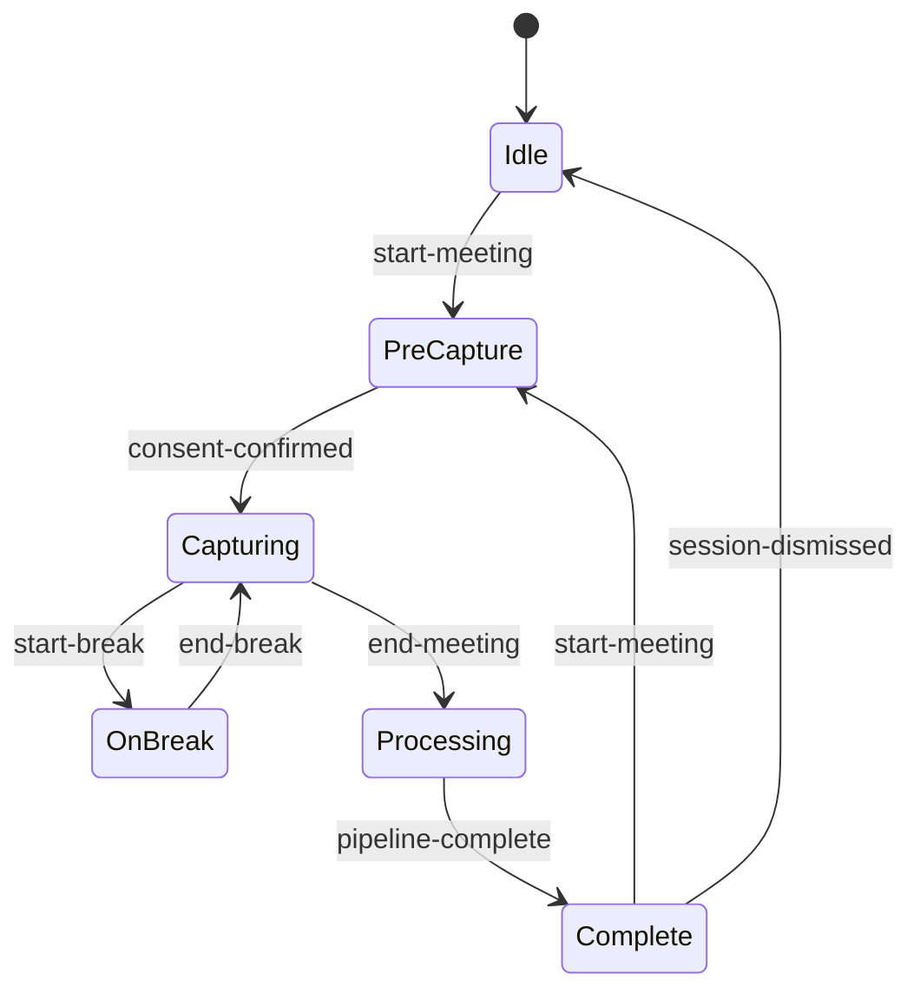
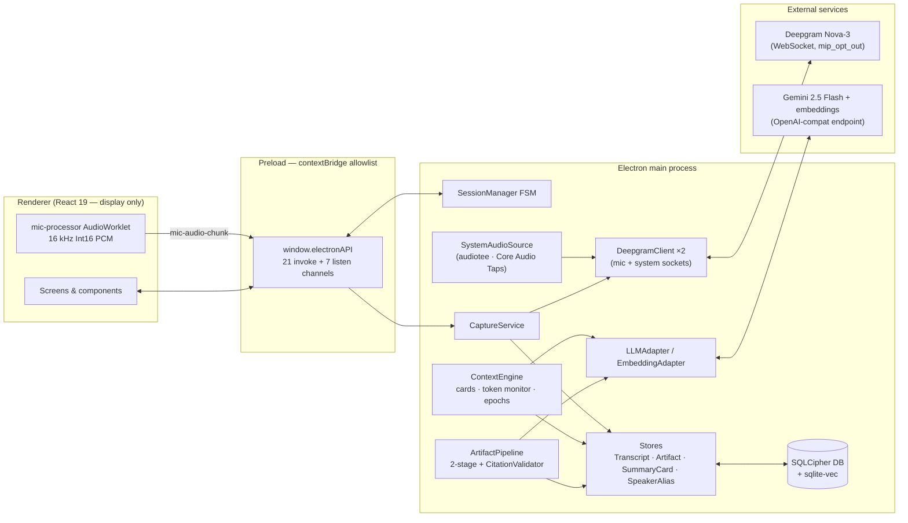
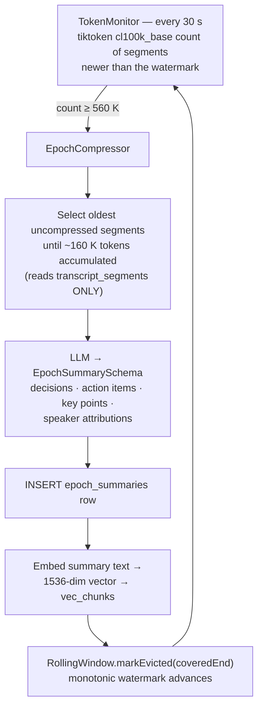
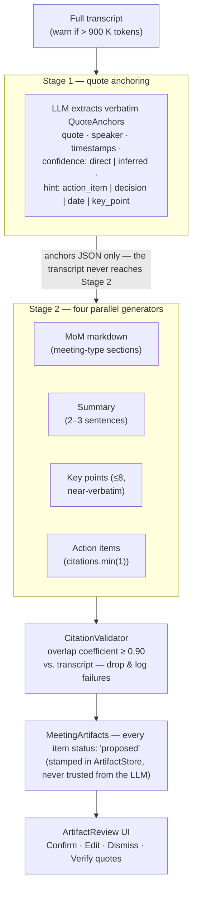

# MeetingAssist

**A macOS desktop AI meeting assistant that lives in a side overlay — no bot joins your call, nothing leaves your machine unencrypted, and every generated claim is backed by a verbatim quote from the transcript.**


MeetingAssist runs as a persistent, transparent overlay on the right edge of your screen during any live meeting — Zoom, Meet, Teams, a phone call on speaker, or an in-person conversation. It captures a **dual-channel transcript** (your microphone + system audio, diarized per speaker), shows a **live summary board** that refreshes every five minutes, covers for you with a **break assist digest** when you step away, and when the meeting ends produces a complete set of artifacts: **minutes of meeting, summary, key points, and action items with dates — every one citation-backed and ready to export to any calendar**.

**Core value:** you walk out of any meeting with an accurate, trustworthy record and a ready-to-act set of artifacts — without having taken a single note.

### The five pillars

| Pillar | What it means in practice |
|---|---|
| 🕶 **No visible bot** | Audio is tapped from your own mic and system output. Nothing joins the call; no "MeetingAssist has joined" banner, ever. |
| 🔐 **You own your data** | Local-first. The entire database is SQLCipher AES-256 encrypted with a key held in the macOS Keychain. Raw audio is never written to disk. |
| 📎 **Trustworthy records** | Two-stage extraction: artifacts are generated *only* from verbatim quotes, then a deterministic ≥90 % word-overlap validator drops anything the LLM can't ground. |
| ⏱ **Real-time awareness** | 5-minute summary cards stack live in the overlay; a break digest replays what you missed. |
| ✅ **Private by design** | Explicit consent gate enforced in the state machine (not just the UI), Deepgram `mip_opt_out` hardcoded, overlay excluded from screen capture. |

---

## Table of contents

- [Features](#features)
- [How a session works — the 5-minute tour](#how-a-session-works--the-5-minute-tour)
- [Architecture overview](#architecture-overview)
- [Pipeline deep dives](#pipeline-deep-dives)
  - [1. Dual-channel audio capture](#1-dual-channel-audio-capture)
  - [2. Real-time transcription](#2-real-time-transcription)
  - [3. Live context engine](#3-live-context-engine)
  - [4. Artifact pipeline — the faithfulness architecture](#4-artifact-pipeline--the-faithfulness-architecture)
  - [5. Speaker rename](#5-speaker-rename)
  - [6. Calendar export](#6-calendar-export)
- [Data & persistence](#data--persistence)
- [Security & privacy model](#security--privacy-model)
- [IPC contract reference](#ipc-contract-reference)
- [UI & component tour](#ui--component-tour)
- [AI / LLM design](#ai--llm-design)
- [Evaluation harness](#evaluation-harness)
- [Testing](#testing)
- [Getting started](#getting-started)
- [Project structure](#project-structure)
- [Tech stack & key decisions](#tech-stack--key-decisions)
- [Roadmap & status](#roadmap--status)

---

## Features

### During the meeting

- **Dual-channel live transcription** — your microphone and the system's audio output are captured on two independent channels and transcribed in real time by Deepgram Nova-3 with speaker diarization. Your voice is labeled **You**; remote participants become **Speaker 1…8**.
- **Live summary board** — every 5 minutes, the last interval of transcript is condensed into a card (topic headline, 1–5 key points, per-speaker contributions) that stacks newest-first in the overlay. Silent intervals produce no card — never a padded empty one.
- **Break assist** — hit *Going on Break* and the overlay collapses to an "On a Break" panel while capture continues. When you return, a **"While You Were Away"** digest replays exactly the summary cards generated since you left.
- **Channel health dots** — per-channel status indicators (idle / healthy / silent / error) so you know instantly if the mic or system tap has gone quiet or dropped.
- **Consent gate** — capture is physically impossible until the recording disclosure is acknowledged. The gate is enforced inside the main-process state machine, not just as a disabled button.
- **Meeting types** — pick *General*, *Standup*, *1:1*, or *Planning* at the consent screen; the eventual minutes are structured with type-specific sections (e.g. Yesterday/Today/Blockers for standups).

### After the meeting

- **Minutes of Meeting (MoM)** — structured markdown minutes with type-conditional sections, attendees, and action items.
- **Summary & key points** — a 2–3 sentence summary plus up to 8 ranked, near-verbatim key points.
- **Action items with citations** — only explicit commitments are extracted, each with owner, resolved ISO due date (or the raw phrase like *"sometime next week"* preserved unresolved), and **at least one verbatim citation** — enforced at the schema level (`citations.min(1)`).
- **Verify toggle** — every item has a *Verify* button that reveals its supporting quote(s) with speaker and `m:ss` timestamp. Items the model inferred rather than heard verbatim carry an amber **"Inferred — no direct quote"** badge — surfaced, never silently suppressed.
- **Proposed-with-confirm contract** — everything arrives as `proposed`. You Confirm, Edit-and-Confirm, or Dismiss. Nothing is ever auto-written to an external system.
- **One-click `.ics` export** — confirmed calendar-worthy action items export as a universal `.ics` file that imports into Google Calendar, Outlook, Apple Calendar — zero OAuth.
- **Named speaker attribution** — after the meeting, rename `Speaker 2` → `Priya` once and the rename propagates transactionally through minutes, action items, citations, summary cards, and epoch summaries. The raw transcript is never mutated — aliases resolve at read time.
- **Meeting titles** — name the meeting inline during review.

### Under the hood

- **Encrypted local store** — SQLCipher AES-256 whole-database encryption; key generated on first run, encrypted via Electron `safeStorage` (macOS Keychain), stored `0o600`.
- **Long-meeting context engine** — a token monitor polls the live transcript every 30 s with `tiktoken`; when the working set crosses **560 K tokens (70 % of an 800 K ceiling)**, an epoch compressor summarizes the oldest segments down to a **400 K floor** and embeds each epoch into a `sqlite-vec` vector table.
- **Adversarial eval harness** — a 60-case corpus across 8 adversarial categories (fabrication bait, attribution bait, inference traps…) scores the pipeline on hallucination metrics with hard ship gates.

### Shipped vs. planned

| Capability | Status |
|---|---|
| Consent-gated dual-channel capture + live transcription | ✅ Shipped |
| Live summary board + break assist | ✅ Shipped |
| Two-stage citation-validated artifact pipeline | ✅ Shipped |
| `.ics` calendar export | ✅ Shipped |
| Encrypted storage + context engine (epoch compression) | ✅ Shipped |
| Packaging, notarization config, eval harness | ✅ Shipped |
| Named speaker attribution | ✅ Shipped |
| Meeting-type artifact templates | ✅ Shipped |
| Cross-meeting semantic search | 🚧 In progress (vector infra already live) |
| Live in-meeting assistant chat | 📋 Planned (streaming + context infra already live) |
| Direct Google/Outlook calendar APIs, Slack/Notion integrations | 📋 Deferred |

---

## How a session works — the 5-minute tour

Every session flows through a strict finite state machine (`src/main/session/SessionManager.ts`). The FSM is the *only* path to starting or stopping capture — direct calls that bypass it are forbidden by convention and impossible via IPC.



1. **Idle** — the overlay shows a single *Start Meeting* button (plus settings and quit).
2. **PreCapture** — the **consent gate**. A recording disclosure, a meeting-type selector, and a checkbox that must be ticked before the button enables. The FSM independently refuses to leave `PreCapture` without a `consent-confirmed` event — a compromised renderer cannot skip the gate.
3. **Capturing** — a fresh `meetingId` (UUID) is minted, both audio channels connect to Deepgram, the `ContextEngine` starts, and summary cards begin arriving on the 5-minute cadence. Returning from a break re-enters `Capturing` **without** minting a new meeting or restarting capture (the FSM handler checks `previous !== 'OnBreak'`).
4. **OnBreak** — capture continues silently; the UI shows the break panel with an *I'm Back* button.
5. **Processing** — capture stops, the context engine halts, and the **ArtifactPipeline** runs over the full transcript. If it throws, the user still gets a graceful payload: *"Artifact generation failed — your transcript is saved."*
6. **Complete** — the artifact review screen: confirm/edit/dismiss items, verify citations, rename speakers, title the meeting, export `.ics`, then start the next meeting or dismiss.

Illegal transitions throw (`FSM: invalid transition …`) rather than silently no-op. Window interactivity tracks the state too: the overlay is click-through in inactive states, mouse-interactive in `Idle`/`PreCapture`/`Capturing`/`OnBreak`/`Complete`, and keyboard-focusable **only** in `Complete` (the one state where you type).

---

## Architecture overview

Everything that matters — audio, STT sockets, database, LLM calls, session logic — runs in the **Electron main process**. The renderer is a display surface: it receives typed IPC pushes and sends user actions over an allowlisted bridge. There is no raw `ipcRenderer` in the renderer, and no business logic either.



### The cast, service by service

| Service | File | Responsibility |
|---|---|---|
| `SessionManager` | `src/main/session/SessionManager.ts` | Authoritative FSM with a hardcoded transition table and the consent gate. Emits `state-change`; all lifecycle wiring hangs off it. |
| `CaptureService` | `src/main/capture/CaptureService.ts` | Orchestrates the two Deepgram clients and the system-audio source; persists finalized segments; pushes health updates. |
| `SystemAudioSource` | `src/main/capture/SystemAudioSource.ts` | Wraps the `audiotee` native binary (Core Audio Taps). Distinguishes "never started" (→ fallback signal) from "crashed after start" (→ 3 retries @ 2 s). |
| `DeepgramClient` | `src/main/capture/DeepgramClient.ts` | One real-time WebSocket per channel: utterance buffering, silence detection, self-managed reconnection. |
| `SpeakerNormalizer` | `src/main/capture/SpeakerNormalizer.ts` | Deepgram numeric speaker IDs → stable labels (`You` / `Speaker 1..8`). |
| `ContextEngine` | `src/main/context/ContextEngine.ts` | Orchestrates `SummaryCardTimer`, `TokenMonitor`, `EpochCompressor`, `ContextComposer`, `RollingWindow`. |
| `ArtifactPipeline` | `src/main/pipeline/ArtifactPipeline.ts` | Post-meeting two-stage extraction: verbatim quote anchors → four parallel artifact generators → citation validation. |
| `CitationValidator` | `src/main/pipeline/CitationValidator.ts` | Deterministic word-overlap grounding gate (overlap coefficient ≥ 0.90). |
| `LLMAdapter` / `EmbeddingAdapter` | `src/main/llm/` | Structured-output Gemini calls via the OpenAI-compatible endpoint; 1536-dim embeddings with a hard dimension assert. |
| Stores | `src/main/store/`, `src/main/transcript/` | Prepared-statement data access over the encrypted DB: transcripts, artifacts, summary cards, speaker aliases. |
| `CalendarExportService` | `src/main/calendar/CalendarExportService.ts` | Confirmed action items → universal `.ics` via a save dialog. |

The main entry point (`src/main/index.ts`) wires all of this together: it gates on macOS ≥ 14.2 (Darwin kernel ≥ 23.2, required for Core Audio Taps), opens the encrypted DB, creates the overlay window, instantiates every service, subscribes the whole lifecycle to FSM transitions, and registers all 21 IPC handlers — each one validating its payload with Zod before touching anything.

---

## Pipeline deep dives

### 1. Dual-channel audio capture

The two channels are captured in **different processes** — a deliberate split that plays to each side's strengths.

**Mic channel (renderer → main).** The renderer calls `getUserMedia` with echo cancellation, noise suppression, and auto-gain **all disabled** (Deepgram wants raw signal), builds a 16 kHz `AudioContext`, and loads `src/renderer/public/audio/mic-processor.worklet.js`. The worklet buffers Float32 samples and flushes every **4,000 samples (250 ms at 16 kHz)**, converting to Int16 PCM and posting the buffer with a **zero-copy transferable**. `src/renderer/src/audio/MicCapture.ts` forwards each chunk over the `mic-audio-chunk` IPC channel as a raw `ArrayBuffer` (a deliberate workaround for Electron IPC issue #35152). The main process guards every chunk — type-checked and capped at 1 MiB — before handing it to the mic Deepgram socket. The worklet node is intentionally never connected to the audio destination: capture only, no monitoring loop.

**System channel (main process).** `SystemAudioSource` spawns the bundled `audiotee` binary, which taps macOS **Core Audio Taps** (macOS 14.2+) *pre-mixer* — it hears exactly what your speakers play, without the purple screen-recording indicator a loopback capture would trigger. Configured at 16 kHz with 250 ms chunks to mirror the mic path, each chunk is forwarded straight to the system Deepgram socket and **never written to disk**. Failure handling distinguishes two modes:

- error **before** the first successful start → emits `fallback-needed` (audiotee unavailable; the Chromium-loopback fallback is a documented v1 limitation surfaced as a channel error),
- crash **after** a successful start → up to 3 automatic restarts with a 2 s delay, then a channel `error` state.

**Channel health.** Both channels report one of four states — `idle`, `healthy`, `silent` (no Deepgram traffic for 5 s), `error` — pushed over `capture-health-update` and rendered as the gray/green/yellow/red dots in the overlay.

### 2. Real-time transcription

Each channel gets its **own independent Deepgram WebSocket** (`src/main/capture/DeepgramClient.ts`), so a mic hiccup can't take down system transcription or vice versa. Connection parameters:

```
model: nova-3          diarize: true          mip_opt_out: true   ← hardcoded, never a setting
encoding: linear16     sample_rate: 16000     interim_results: true
punctuate: true        smart_format: true     endpointing: 100    utterance_end_ms: 1000
```

The client buffers `is_final` fragments into a growing utterance (tracking start time, end time, confidence, and the first diarized speaker ID) and flushes on Deepgram's `UtteranceEnd` message. The buffer is instance-scoped so `disconnect()` can **flush the final utterance before closing** — the last thing said in a meeting is never lost.

**Reconnection is self-managed** (the SDK's auto-reconnect is disabled): on close/error the client retries up to 3 times with 2 s delays, and critically **resets the `SpeakerNormalizer`** first, because a new Deepgram connection restarts speaker numbering from zero.

**Speaker normalization** (`SpeakerNormalizer.ts`): the mic channel is always **You** — it's your microphone. The system channel maps Deepgram's numeric IDs to `Speaker 1`, `Speaker 2`, … in first-heard order, capped at 8 (anyone beyond reuses `Speaker 8`).

Finalized segments flow through `CaptureService.handleSegment`: persisted to `transcript_segments` with a UUID, and pushed to the renderer on `transcript-segment` — display data only, never audio.

### 3. Live context engine

The `ContextEngine` (`src/main/context/`) runs for the duration of `Capturing` and does two jobs on two independent clocks:

**Job 1 — summary cards (5-minute clock).** `SummaryCardTimer` uses a *self-rescheduling* `setTimeout` (not `setInterval`) so a slow LLM call can never overlap the next tick. Each fire selects the last 5 minutes of segments by wall clock; **if the interval was silent it skips the LLM call entirely** — no empty cards. Otherwise it prompts Gemini against `SummaryCardSchema` (≤10-word topic headline, 1–5 key points, contributions only for speakers who actually spoke), persists to `summary_cards`, and pushes `summary-card-ready`. **Break assist is a query, not a subsystem**: when you return, the main process fetches `getCardsSince(breakStartMs)` and ships the missed cards as the digest.

**Job 2 — token budget management (30-second clock).** Long meetings would eventually overflow any LLM context window. The engine holds the working set inside a budget triple:

```
800 K ceiling  →  560 K (70 %) compression trigger  →  400 K (50 %) post-compression floor
```



Load-bearing details:

- **Source-of-truth invariant:** the compressor reads **exclusively from `transcript_segments`** — never from `summary_cards`, which are display artifacts. Compressing a summary of a summary would compound distortion.
- `RollingWindow` is a monotonic watermark (`Math.max` on advance) — a late or duplicate compression pass can never move coverage backwards.
- `tiktoken` encoders are created once per pass and freed in `finally` (they're WASM objects; leaking them across a 3-hour meeting would hurt). Token counting is exact — character-based approximations drift 15–20 % over long meetings and are banned in this codebase.
- The embedding step **asserts `vector.length === 1536`** before insert, so a silent embedding-model change can't corrupt the fixed-width `vec_chunks float[1536]` table.
- Compression failures are caught, logged, and return null — a failed epoch never crashes a live meeting.
- `ContextEngine.start()` is idempotent (a second start tears down the first), preventing duplicate polling intervals.
- `ContextComposer.getContext()` — the uncompressed tail plus all epoch summaries — is **v1 infrastructure with no v1 consumer**: it exists for the planned live assistant chat.

### 4. Artifact pipeline — the faithfulness architecture

This is the trust core of the product (`src/main/pipeline/ArtifactPipeline.ts`). The design guards against both hallucination modes: **extrinsic** (inventing an action item nobody committed to) and **intrinsic** (misrepresenting — wrong owner, mangled date, inverted decision).



**Stage 1** demands *verbatim* copying — the prompt includes explicit allowed/forbidden paraphrase examples — plus exact speaker labels, timestamps or `null`, `direct`/`inferred` confidence ("when in doubt, inferred"), and raw date expressions recorded unresolved.

**Stage 2** runs four `Promise.all` calls that consume **only the anchor JSON**. Physically separating "what was said" from "what it means" is what makes grounding checkable. Highlights:

- **MoM** interpolates meeting-type section skeletons (`general`: Agenda/Discussion/Decisions/Next Steps · `standup`: Yesterday/Today/Blockers · `1:1`: Topics/Feedback/Growth/Follow-ups · `planning`: Decisions/Next Steps/Open Questions). The LLM-facing schema deliberately **omits `meeting_type`** — it's stamped programmatically afterward, because an LLM should never be trusted to echo back a control field.
- **Action items** extract only *explicit commitments* (with do-not-extract counterexamples in the prompt: "we should probably look into it" is not a commitment). Dates resolve against the meeting date injected into the prompt — otherwise `null` with `raw_deadline_text` preserved. `status` is always `"proposed"`; `is_calendar_event` distinguishes scheduled events from tasks-with-deadlines.
- **Key points** must be ≥90 % word-overlap excerpts of their anchors, with the supporting `quote_preview` copied verbatim so validation can pair them back up.

**Validation** is deterministic set math, not another LLM call. `CitationValidator` tokenizes claim and quote (lowercase, `\W+` split) and computes the **overlap coefficient** `|A∩B| / min(|A|,|B|)` — chosen over Jaccard so a claim that's a clean subset of a longer quote still passes; Jaccard would over-penalize the quote's extra context words. Threshold: **0.90**. Failing items are dropped and logged — there is intentionally **no LLM retry loop** (retries burn tokens for near-zero grounding gain).

Empty meetings degrade gracefully: a blank transcript or zero anchors returns a valid empty-artifacts payload ("No actionable content extracted") rather than an error.

### 5. Speaker rename

Post-meeting rename (`src/main/store/SpeakerAliasStore.ts` + `speakerRename.ts`) is built on one invariant: **`transcript_segments` is immutable**. Renames live in a `speaker_aliases` table (PK `(meeting_id, original_label)`) resolved at read time, and propagate through derived artifacts in a **single transaction** across four subsystems: `artifacts.content_json`, `action_items` (assignee + citations), `summary_cards.speaker_contributions_json`, and `epoch_summaries.speaker_attributions_json`.

The propagation machinery is careful where careless string surgery would corrupt data: word-boundary regexes (so renaming `Speaker 1` doesn't clobber `Speaker 10`), `$`-escaped replacement strings (so a name containing `$&` can't inject regex backreferences), and **parse → deep-walk → stringify** for all JSON columns (never regex over serialized JSON — quotes and backslashes in names round-trip safely). Re-renames are idempotent: the effective current name is looked up first, so renaming A→B→C works and A→A is a no-op.

The IPC handlers (`get-speaker-roster`, `rename-speakers`) are **state-gated to `Complete`** in the main process — you cannot rename mid-capture.

### 6. Calendar export

`CalendarExportService` exports **only** items that are (a) confirmed by you, (b) flagged `is_calendar_event`, and (c) carry a parseable `YYYY-MM-DD` due date. Everything else counts into a `skippedCount` surfaced in the UI ("2 skipped — no due date"). Events are all-day entries with `Owner: <assignee>` descriptions and stable `<id>@meetingassist` UIDs, written wherever the native save dialog points (default `~/Downloads/meeting-actions.ics`), then stamped with `ics_exported_at` for idempotent tracking. Universal `.ics` means zero OAuth and every calendar app on earth.

---

## Data & persistence

### Database initialization (exact sequence)

```
1. safeStorage availability check (macOS Keychain) — fatal if unavailable
2. Key: first run → crypto.randomBytes(32) hex, safeStorage-encrypted,
   written to <userData>/.meetingassist.key with mode 0o600
   later runs → read + decrypt
3. Open <userData>/meetingassist.db  →  PRAGMA key = '<key>'   (SQLCipher AES-256)
4. sqliteVec.load(db)          ← must precede any vec0 DDL
5. Run all table DDLs          (not inside an explicit transaction — vec0
                                virtual tables misbehave in one)
6. Idempotent additive migrations (pragma table_info–guarded ALTER TABLEs)
```

### Schema — 8 tables

| Table | What it holds | Notable columns / constraints |
|---|---|---|
| `meetings` | One row per session | `meeting_type` CHECK-constrained to `general/standup/1:1/planning` (mirrors `MeetingTypeSchema` — single source of truth) |
| `transcript_segments` | The immutable transcript | `channel` CHECK `mic/system`, `speaker_label`, timestamps, `confidence`; indexed by meeting |
| `vec_chunks` | Vector index (virtual table `USING vec0`) | `embedding float[1536]` + auxiliary `chunk_id`, `speaker_label`, `text_preview` columns |
| `artifacts` | MoM / summary / key-points / action-items JSON blobs | `artifact_type` CHECK-constrained; `model_used` recorded |
| `action_items` | Individually reviewable items | `status` CHECK `proposed/confirmed/dismissed`, `citations_json`, `is_calendar_event`, `ics_exported_at` |
| `summary_cards` | Live 5-minute cards | interval bounds, `wall_time_label`, key points / contributions JSON |
| `epoch_summaries` | Compressed transcript epochs | covered interval, decisions/actions/key-points JSON, `raw_segment_count`, `token_count_compressed` |
| `speaker_aliases` | Read-time rename map | composite PK `(meeting_id, original_label)` |

All child tables `REFERENCE meetings(id) ON DELETE CASCADE`. Migrations are additive-only and idempotent (duplicate-column errors swallowed), so old databases upgrade in place.

**What is never stored:** raw audio. Chunks stream to Deepgram and evaporate. `raw_audio_path` exists in the schema as a v1 placeholder but nothing writes it.

---

## Security & privacy model

Defense in depth, from the OS down to individual SQL parameters:

- **Consent enforced in the FSM, not the UI** — the `PreCapture → Capturing` transition requires the `consent-confirmed` event inside `SessionManager`; a malicious renderer emitting other events gets an exception, not a recording.
- **Whole-database encryption** — SQLCipher AES-256, key from `crypto.randomBytes(32)`, encrypted at rest via `safeStorage` (Keychain-backed), file mode `0o600`.
- **API keys encrypted at rest** — Gemini/Deepgram keys entered in Settings are `safeStorage`-encrypted inside `electron-store`; `electron-store` never holds transcripts, artifacts, or plaintext secrets.
- **The overlay can't be screen-captured** — `setContentProtection(true)` excludes the window from screenshots and screen shares. Your meeting notes don't leak into the meeting.
- **Hardened IPC surface** — `contextIsolation: true`, `nodeIntegration: false`, no raw `ipcRenderer` ever exposed. The preload (`src/preload/index.ts`) exposes exactly three methods over a channel allowlist; unlisted channels are rejected by name.
- **Every renderer payload is Zod-validated in main** — IDs, titles (max 200 chars), rename maps (trimmed, 1–100 chars), widths (clamped 280–600), audio chunks (`ArrayBuffer`, ≤ 1 MiB). Enum allowlists guard meeting types and the System Preferences deep links.
- **State-gated handlers** — speaker roster/rename only answer in `Complete`.
- **Parameterized SQL everywhere** — every statement binds `meeting_id = ?`; nothing is string-concatenated.
- **Vendor-side privacy** — Deepgram `mip_opt_out: true` is hardcoded (a product commitment, deliberately not a setting). The Settings panel shows a permanent, non-dismissable warning that Gemini's **free tier trains on your data — a paid plan is required**.
- **No LLM-trusted control fields** — `status: 'proposed'` and `meeting_type` are stamped programmatically; prompt instructions live only in the system role, transcript text only in the user role (prompt-injection separation).

---

## IPC contract reference

The complete surface. Nothing else crosses the process boundary.

### Renderer → main (`invoke`, 21 channels)

| Channel | Payload | Purpose |
|---|---|---|
| `start-meeting` | — | Idle/Complete → PreCapture |
| `consent-confirmed` | `{meetingId, timestamp, meetingType}` | Pass the consent gate; begin capture |
| `mic-audio-chunk` | `ArrayBuffer` (≤ 1 MiB) | Stream 250 ms Int16 PCM mic chunks |
| `end-meeting` | — | Capturing → Processing |
| `start-break` / `end-break` | — | Break assist enter/leave (leave triggers the digest) |
| `dismiss-session` | — | Complete → Idle |
| `confirm-artifact` | `{id, type}` | Confirm a proposed action item |
| `edit-artifact` | `{id, updates}` | Edit description / due date / assignee |
| `dismiss-artifact` | `{id}` | Dismiss a proposed item |
| `export-ics` | `{meetingId}` | Save dialog → `.ics`; returns `{filePath, skippedCount}` |
| `set-meeting-title` | `{meetingId, title}` | Name the meeting (1–200 chars) |
| `get-speaker-roster` | `{meetingId}` | Roster with per-speaker excerpts (Complete-only) |
| `rename-speakers` | `{meetingId, mapping}` | Transactional rename; returns refreshed artifacts (Complete-only) |
| `get-settings` / `set-setting` | key/value | API keys (encrypted), overlay width/opacity |
| `get-permission-status` | — | Mic + screen permission pull |
| `open-permission-settings` | `'microphone' \| 'screen'` | Deep-link to System Preferences |
| `set-focusable` | `boolean` | Keyboard focus toggle (Settings panel) |
| `resize-window` | `{width}` | Right-anchored resize, clamped 280–600 px |
| `quit-app` | — | Quit |

### Main → renderer (push, 7 channels)

| Channel | Payload | Renders as |
|---|---|---|
| `session-state-changed` | `{state, previous}` | Screen routing |
| `transcript-segment` | `TranscriptSegment` | (live transcript feed) |
| `summary-card-ready` | `StoredSummaryCard` | New card atop the live board |
| `break-assist-digest-ready` | `{cardsMissed, isEmpty}` | "While You Were Away" |
| `artifact-proposals-ready` | `MeetingArtifacts` | The review screen |
| `capture-health-update` | `{channel, status}` | Health dots |
| `permission-status` | `{microphone, screen}` | Permission warning cards |

---

## UI & component tour

### The overlay window

A frameless, transparent, always-on-top (`screen-saver` level) panel anchored to the right edge of the primary display, full height, default **380 px** wide and drag-resizable between **280–600 px** via a 6 px left-edge handle. It's visible on all Spaces including fullscreen apps, hidden from the Dock and task switcher, excluded from screen capture, and **click-through** whenever the current state has nothing interactive — mouse events forward to whatever is underneath. Dark glass aesthetic: `rgba(0,0,0,0.85)` over transparency.

### Screens by state

| State | Components |
|---|---|
| Idle | Start Meeting button · `SettingsPanel` (gear) · quit |
| PreCapture | `ConsentGate` — disclosure, meeting-type picker, consent checkbox, permission warning cards with *Fix in System Preferences* deep links |
| Capturing (pre-board) | `CapturingScreen` — health dots + Stop Meeting · break footer |
| Capturing (board) | Compact header (`ChannelHealthDot` + Stop) · `LiveSummaryBoard` → stacked `SummaryCard`s (newest highlighted) · break footer |
| Capturing (post-break) | `BreakAssistDigest` — missed cards or a friendly empty state |
| OnBreak | `BreakAssistPanel` — "Capture continues…", *I'm Back* |
| Complete | Spinner ("Processing artifacts…") → `ArtifactReview` |

**`ArtifactReview`** is the richest screen: a meeting-title input; collapsible sections for action items (default-open), summary, key points, and MoM; per-item `ArtifactItem` rows with inline editing, Confirm/Dismiss, and the **Verify** toggle opening a `CitationPanel` (speaker, `m:ss` timestamp, amber *inferred* tag, italicized full quote); an *Export to Calendar (.ics)* button that appears once anything is confirmed; and footer actions for *Rename Speakers* (→ `RenameSpeakersModal` with per-speaker transcript excerpts), *Start New Meeting*, and *Dismiss*.

Renderer state plumbing is deliberately thin: one custom hook per push channel (`useSessionState`, `useSummaryCards`, `useArtifactProposals`, `useBreakDigest`, `useCapturingHealth`, `usePermissionStatus`) subscribed once on mount in `App.tsx`.

---

## AI / LLM design

### Models

| Role | Model | Access path |
|---|---|---|
| Speech-to-text | Deepgram `nova-3` (diarized, dual WebSocket) | `@deepgram/sdk` real-time |
| Generation (cards, epochs, all artifacts) | `gemini-2.5-flash` | `openai` SDK → Gemini's OpenAI-compatible `baseURL` |
| Embeddings | `gemini-embedding-001` @ **1536 dims** | Same endpoint |

### Structured output, one schema to rule them all

Every LLM call goes through `LLMAdapter.generate(schema, name, system, user)` with `response_format: zodResponseFormat(...)`. All schemas live in **one file** — `src/shared/schemas/index.ts` — and serve triple duty as TypeScript types, runtime validators, and the LLM's JSON schema. Hand-authoring provider-specific schemas is banned. If structured parsing fails, the adapter falls back to `schema.parse(JSON.parse(raw))` and otherwise throws — malformed output never propagates.

Notable schema-level guarantees: `ActionItemSchema` requires `citations.min(1)` and `status: z.literal('proposed')`; `SummaryCardSchema` bounds key points to 1–5.

### Token accounting

A per-model accumulator prints a usage table at each session's end. It handles a Gemini quirk: thinking tokens are billed as output but excluded from `completion_tokens`, so true output is computed as `total_tokens − prompt_tokens` (floored at `completion_tokens`).

### Error philosophy

Background AI subsystems **never crash a live session**. Card generation errors log and skip a tick; epoch compression errors log and return null; the artifact pipeline's top-level catch delivers a graceful "transcript is saved" payload. The only fatal startup error is a failed encrypted-DB open — by design, the app won't run unencrypted.

`LLMAdapter.stream()` (an async-generator streaming path) exists and is tested but unused in v1 — it's the substrate for the planned live assistant chat.

---

## Evaluation harness

The pipeline's honesty is measured, not assumed. `eval/harness.ts` is a standalone adversarial harness (separate from Vitest) that replays synthetic meetings through the **real** `ArtifactPipeline` against an in-memory database.

### Metrics

| Metric | Definition | Ship gate |
|---|---|---|
| **CGFS** — Citation-Grounded Faithfulness Score | verifiable items ÷ total (verifiable = first citation ≥ 0.90 token overlap with transcript) | **≥ 0.85** overall |
| **EHR** — Extrinsic Hallucination Rate | no-evidence items ÷ total (< 0.35 overlap with transcript) | **≤ 0.05** overall |
| Per-category floor | worst adversarial category's CGFS | **≥ 0.75** |
| **IDR** — Intrinsic Distortion Rate | wrong-speaker / mangled-date / inverted-decision items | manual review, no v1 numeric gate |

All three numeric gates must hold simultaneously; the harness exits 0 ("shippable") or 1 accordingly and writes `eval/corpus/eval_report.json` with per-category breakdowns and token spend.

### The corpus — 60 cases, 8 categories

| Category | Cases | What it stresses |
|---|---|---|
| `standard_sync` | 10 | Baseline team meetings |
| `action_item_dense` | 10 | Recall under commitment overload |
| `date_heavy` | 10 | Relative-date resolution ("next Friday", "end of Q3") |
| `fabrication_bait` | 10 | Planted vague non-commitments ("we should probably look into it") that must **not** become action items |
| `attribution_bait` | 5 | Statements engineered to tempt wrong-speaker attribution |
| `high_speaker_count` | 5 | Diarization-label fidelity at 6–8 speakers |
| `implicit_inference_traps` | 5 | Items that are *implied* — must surface as `inferred`, never `direct` |
| `short_no_content` | 5 | Near-empty meetings — correct answer is *nothing* |

Each case carries ground truth plus explicit `adversarial_injections` with expected behavior (`not-extracted` / `flagged-inferred`). Scoring is worst-case-honest: a pipeline crash scores CGFS 0 / EHR 1.

```bash
GEMINI_API_KEY=... npx ts-node eval/harness.ts              # full live run
npx ts-node eval/harness.ts --category fabrication_bait     # one category
npx ts-node eval/harness.ts --mock                          # zero-API scoring-logic regression
npx ts-node eval/smoke-test.ts                              # one fixture end-to-end
```

---

## Testing

**165 tests across 20 files**, all main-process + shared logic (`npm test`, Vitest, node environment):

| Area | Files | Coverage highlights |
|---|---|---|
| Session FSM | `tests/session.test.ts` | Every legal transition + illegal-transition throws + consent gate |
| Capture | `CaptureService`, `DeepgramClient`, `SpeakerNormalizer`, `mic-processor` tests | Utterance buffering, reconnection, PCM conversion, 8-speaker cap |
| Persistence | `db`, `TranscriptStore`, `SpeakerAliasStore`, `speakerRename` tests | Encrypted DDL, alias propagation, JSON-safe renames |
| Context engine | `ContextEngine`, `ContextComposer`, `TokenMonitor`, `RollingWindow`, pipeline integration | Budget triple, watermark monotonicity, idempotent start; includes a simulated 60-minute meeting |
| Artifact pipeline | `ArtifactPipeline`, `CitationValidator` tests | Two-stage flow, overlap-coefficient edge cases |
| Everything else | calendar export, break digest, epoch & meeting-type schemas | |

The adversarial eval harness (above) is the second, independent quality gate.

---

## Getting started

### Prerequisites

- **macOS 14.2 (Sonoma) or later** — hard requirement; Core Audio Taps (the bot-free system-audio tap) shipped in 14.2. The app checks the kernel version at launch and refuses politely otherwise.
- **Node.js 20+** and npm.
- A **Deepgram API key** (Nova-3 streaming).
- A **Gemini API key on a paid plan** — this matters: Google's free tier permits training on your data, i.e. on your meetings. The app warns about this permanently in Settings.

### Install & run

```bash
git clone https://github.com/ubairrr/MeetingAssist.git
cd MeetingAssist
npm install        # postinstall rebuilds better-sqlite3-multiple-ciphers against Electron's ABI
npm run dev
```

Provide keys either way:

- **In-app (recommended):** gear icon → Settings → paste keys. They're encrypted via the Keychain before touching disk.
- **Dev `.env`:** `DEEPGRAM_API_KEY=...` and `GEMINI_API_KEY=...` (injected at build time by electron-vite).

On first capture, macOS will prompt for **Microphone** and **Screen/System Audio Recording** permissions. The consent screen shows warning cards with one-click *Fix in System Preferences* deep links if either is denied.

```bash
npm test                 # 165 Vitest tests
npm run build            # production build
npm run build:mac-dir    # unpacked .app for local inspection
```

### Packaging & notarization

`electron-builder.yml` ships `asar: true` with careful `asarUnpack` — the `better-sqlite3-multiple-ciphers` `.node` binary, both `sqlite-vec` platform packages, and the `audiotee` Swift binary (also bundled via `extraResources`) must live outside the asar to load at runtime. macOS builds use `hardenedRuntime: true` with entitlements (`allow-jit`, `allow-unsigned-executable-memory`, `disable-library-validation`) required for exactly those native binaries. Notarization runs as an `afterSign` hook (`scripts/notarize.js`) through `@electron/notarize`/`notarytool` — set `APPLE_ID`, `APPLE_ID_PASSWORD`, and `APPLE_TEAM_ID` to enable it; it skips gracefully otherwise.

---

## Project structure

```
MeetingAssist/
├── src/
│   ├── main/                     # Electron main process — all business logic
│   │   ├── index.ts              # Bootstrap: window, DB, services, 21 IPC handlers
│   │   ├── session/              # SessionManager FSM (consent gate)
│   │   ├── capture/              # CaptureService · SystemAudioSource (audiotee)
│   │   │                         #   · DeepgramClient ×2 · SpeakerNormalizer
│   │   ├── context/              # ContextEngine · SummaryCardTimer · TokenMonitor
│   │   │                         #   · EpochCompressor · RollingWindow · ContextComposer
│   │   ├── pipeline/             # ArtifactPipeline (two-stage) · CitationValidator
│   │   ├── llm/                  # LLMAdapter · EmbeddingAdapter (Gemini, OpenAI-compat)
│   │   ├── store/                # db.ts (SQLCipher + sqlite-vec + DDL + migrations),
│   │   │                         #   Artifact/SummaryCard/SpeakerAlias stores, rename helpers
│   │   ├── transcript/           # TranscriptStore
│   │   └── calendar/             # CalendarExportService (.ics)
│   ├── preload/                  # contextBridge allowlist — the only IPC doorway
│   ├── renderer/                 # React 19 display layer
│   │   ├── src/components/       # ConsentGate · LiveSummaryBoard · ArtifactReview ·
│   │   │                         #   CitationPanel · BreakAssist* · Settings · …
│   │   ├── src/audio/            # MicCapture (getUserMedia → worklet → IPC)
│   │   └── public/audio/         # mic-processor.worklet.js (Float32 → Int16, 250 ms)
│   └── shared/schemas/index.ts   # Every Zod schema — single source of truth
├── eval/                         # Adversarial harness + 60-case corpus (standalone)
├── tests/                        # Vitest suites (more live in src/main/**/__tests__)
├── build/                        # Icons + hardened-runtime entitlements
├── scripts/                      # notarize.js (afterSign) · embedding probe
├── electron.vite.config.ts       # 3-target build (main/preload/renderer)
└── electron-builder.yml          # Packaging, asarUnpack, notarization hook
```

---

## Tech stack & key decisions

| Layer | Choice | Why (the decision behind it) |
|---|---|---|
| Shell | Electron 42 + electron-vite 5 | Overlay windows, `safeStorage`, native module ecosystem |
| UI | React 19 (hooks-only) + Vite 7 | Thin display layer; one hook per IPC channel |
| System audio | **`audiotee`** (Core Audio Taps) | Pre-mixer tap, no visible bot, no purple indicator — superseded the earlier `electron-audio-loopback` plan, which triggers the recording indicator |
| STT | Deepgram `nova-3`, diarized, `mip_opt_out` hardcoded | Built for long multi-speaker meetings — `SFSpeechRecognizer` is a short-dictation engine; opt-out is a product commitment, not a toggle |
| LLM | Gemini 2.5 Flash via the `openai` SDK (`baseURL`) | One SDK surface, structured outputs; **paid tier only** — the free tier trains on your data |
| Schemas | `zod` + `zod-to-json-schema` | One definition → TS types + runtime validation + LLM JSON schema; loose JSON-mode prompting banned |
| DB | `better-sqlite3-multiple-ciphers` + `sqlite-vec` 0.1.9 | SQLCipher AES-256 with an actively maintained Apple-Silicon-safe binding (`@journeyapps/sqlcipher` is unmaintained and breaks); vectors co-located with the data they index |
| Tokens | `tiktoken` (cl100k_base) | Exact counts — character approximations drift 15–20 % across a long meeting, which breaks the compression budget |
| Calendar | `ics` | Universal export, zero OAuth; direct APIs deferred |
| Prefs | `electron-store` | Non-sensitive settings only — never transcripts, artifacts, or plaintext secrets |
| Packaging | `electron-builder` + `@electron/notarize` (`notarytool`) | `altool` is dead (deprecated 2023) |

---

## Roadmap & status

**Shipped**

- ✅ **v1.0 — Discovery & PRD** (5 phases): full product spec, architecture, AI faithfulness contract, build order.
- ✅ **v2.0 — Build** (6 phases): the entire v1 product — foundation, capture + transcript store, artifact pipeline, overlay + live board, context engine + break assist, packaging + eval harness.
- ✅ **v3.0 phases 12–13**: named speaker attribution; meeting-type artifact templates.

**In flight**

- 🚧 **Cross-meeting semantic search** — the `sqlite-vec` table and embedding pipeline are already populating; the search UX is being planned.
- 📋 **Live assistant chat** — an in-meeting assistant grounded in the live context window. Its substrate (`ContextComposer`, `LLMAdapter.stream()`, the epoch-compressed context) already ships in v1.

**Deferred**

- Direct Google Calendar / Outlook API integration (`.ics` covers v1)
- Slack / Notion / CRM integrations

---

*Full architectural specs, decision records, and the AI faithfulness contract live in [`.planning/`](.planning/) — start with [`05-PRD.md`](.planning/phases/05-prd-finalization/05-PRD.md).*
